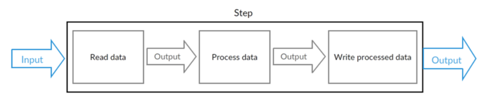

# SpringBatch

​	spring batch是spring提供的一个数据处理框架。企业域中的许多应用程序需要批量处理才能在关键任务环境中执行业务操作。 这些业务运营包括：

* 无需用户交互即可最有效地处理大量信息的自动化，复杂处理。 这些操作通常包括基于时间的事件（例如月末计算，通知或通信）。
* 在非常大的数据集中重复处理复杂业务规则的定期应用（例如，保险利益确定或费率调整）。
* 集成从内部和外部系统接收的信息，这些信息通常需要以事务方式格式化，验证和处理到记录系统中。 批处理用于每天为企业处理数十亿的交易。 

## Spring Batch架构介绍

一个典型的批处理应用程序大致如下：

- 从数据库，文件或队列中读取大量记录。
- 以某种方式处理数据。
- 以修改之后的形式写回数据。

示意图如下：

spring batch的一个总体的架构如下：

​	在spring batch中一个job可以定义很多的步骤step，在每一个step里面可以定义其专属的ItemReader用于读取数据，ItemProcesseor用于处理数据，ItemWriter用于写数据，而每一个定义的job则都在JobRepository里面，我们可以通过JobLauncher来启动某一个job。
 

